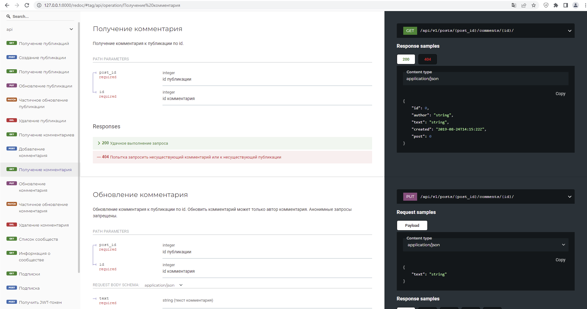

<h1 align="center">API для web проекта YaTube</h1>
<h2 align="center">
  


</p>

  
  


## Описание.
- Проект позволяет осуществлять чтение и редактирование информации на ресурсе www.YaTubeprimer.ru

- Структура проекта выглядит следующим образом:

 

## Корневые маршруты проекта

```
{
    "posts": "http://127.0.0.1:8000/api/v1/posts/",
    "groups": "http://127.0.0.1:8000/api/v1/groups/",
    "follow": "http://127.0.0.1:8000/api/v1/follow/"
}
```

## Общее описание

- Доступ к чтению информации предоставляется всем пользователям.

- Если вы хотите произвести редактирование ранее размещенной информации пожалуста авторизуйтесь.

## Посты проекта YaTube 

### Пост

```
http://127.0.0.1:8000/api/v1/posts/
```


### Комментарии к посту

```
http://127.0.0.1:8000/api/v1/posts/1/comments/
```

## Сообщества проекта YaTube 
!!! На текущий момент создание и редактирование групп через API не осуществляется !!!

- Для получения информации о текущих сообществах проекта YaTube необходимо отправить запрос на:
```
http://127.0.0.1:8000/api/v1/groups/
```
## Подписка на авторов проекта YaTube
!!! Необходима авторизация !!!
```
http://127.0.0.1:8000/api/v1/follow/
```
## Документация проекта API YaTube
```
http://127.0.0.1:8000/api/v1/redoc/
```


## Техническое описание проекта API YaTube

Проек разработан с использованием следующих технологий, модулей, библиотек:

- Django Rest Framework v. 3.12.4
- Djoser (2.1.0)  Simple JWT (4.7.2)
- CORS
- дописать


- Пагинация 
- Фильтрация
- Поиск
- дописать